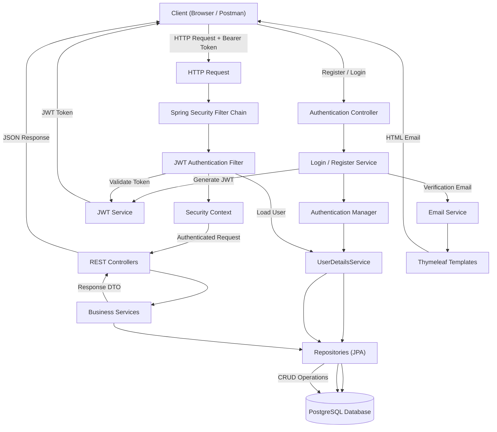
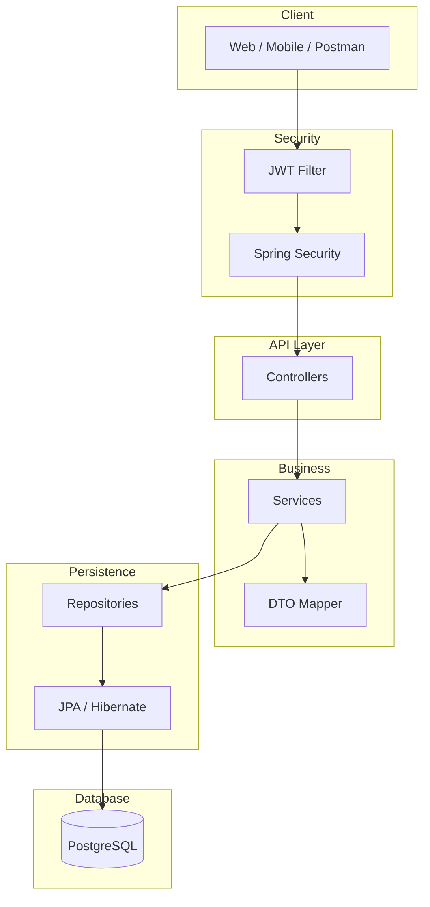
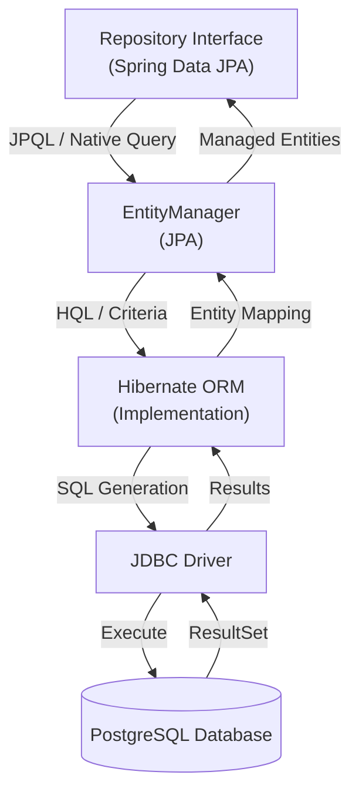
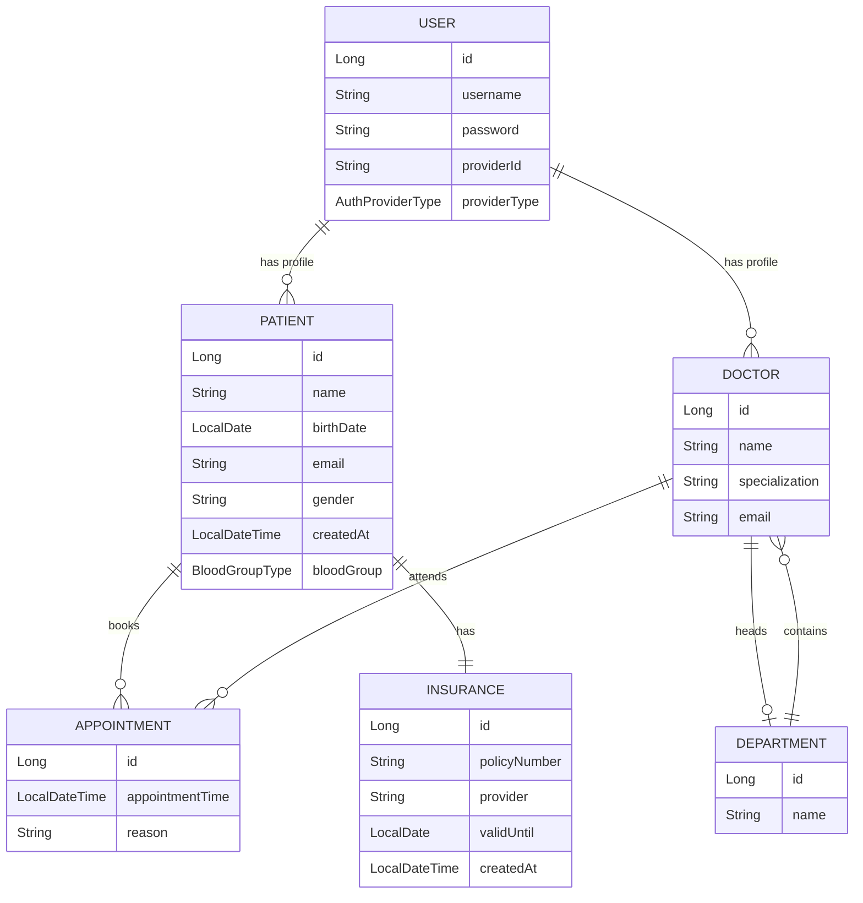

# Spring Boot Hibernate Hospital Management System


A backend project demonstrating how to integrate **Spring Boot** with **Hibernate** and **Spring Data JPA** for a Hospital Management System. The application follows a layered architecture with Role-Based Access Control (RBAC) and performs CRUD operations with authorization checks.

## Overview

This project is built to understand how to implement a production-ready Spring Boot application with Hibernate ORM. It covers the complete request flow from receiving an HTTP request, authenticating the user via JWT, authorizing the request based on user roles and permissions, and accessing protected resources through a well-structured layered architecture.

The project uses Spring Security, dependency injection, repository abstraction, annotation-based configuration, and JPQL queries to minimize boilerplate code while maximizing maintainability.

## Technologies Used

* Java 17+
* Spring Boot 3
* Spring Security
* Spring Data JPA
* Hibernate ORM
* PostgreSQL
* Maven
* Lombok
* JJWT (JSON Web Tokens)
* OpenAPI / Swagger
* Thymeleaf

---

## Project Architecture

The project follows a layered architecture where each layer has a single responsibility.



## Layered Architecture (Standard MVC - Model View Controller Architecture)



## Entity Layer

The entities represent database tables. The project uses Hibernate ORM with JPA annotations for object-relational mapping.

### User Entity

```java
@Entity
@Table(name = "app_user", indexes = {
        @Index(name = "idx_provider_id_provider_type", columnList = "providerId, providerType")
})
public class User implements UserDetails {
    @Id
    @GeneratedValue(strategy = GenerationType.IDENTITY)
    private Long id;

    @JoinColumn(unique = true, nullable = false)
    private String username;
    private String password;

    private String providerId;

    @Enumerated(EnumType.STRING)
    private AuthProviderType providerType;

    @ElementCollection(fetch = FetchType.EAGER)
    @Enumerated(EnumType.STRING)
    Set<RoleType> roles = new HashSet<>();
}
```

### Patient Entity

```java
@Entity
@Table(
        name = "patient",
        uniqueConstraints = {
                @UniqueConstraint(name = "unique_patient_name_birthdate", columnNames = {"name", "birthDate"})
        },
        indexes = {
                @Index(name = "idx_patient_birth_date", columnList = "birthDate")
        }
)
public class Patient {
    @Id
    @GeneratedValue(strategy = GenerationType.IDENTITY)
    private Long id;

    @Column(nullable = false, length = 40)
    private String name;

    private LocalDate birthDate;

    @Column(unique = true, nullable = false)
    private String email;

    private String gender;

    @OneToOne
    @MapsId
    private User user;

    @CreationTimestamp
    @Column(updatable = false)
    private LocalDateTime createdAt;

    @Enumerated(EnumType.STRING)
    private BloodGroupType bloodGroup;

    @OneToOne(cascade = {CascadeType.ALL}, orphanRemoval = true)
    @JoinColumn(name = "patient_insurance_id")
    private Insurance insurance;

    @OneToMany(mappedBy = "patient", cascade = {CascadeType.REMOVE}, orphanRemoval = true, fetch = FetchType.EAGER)
    private List<Appointment> appointments = new ArrayList<>();
}
```

### Doctor Entity

```java
@Entity
public class Doctor {
    @Id
    @GeneratedValue(strategy = GenerationType.IDENTITY)
    private Long id;

    @OneToOne
    @MapsId
    private User user;

    @Column(nullable = false, length = 100)
    private String name;

    @Column(length = 100)
    private String specialization;

    @Column(unique = true, length = 100)
    private String email;

    @ManyToMany(mappedBy = "doctors")
    private Set<Department> departments = new HashSet<>();

    @OneToMany(mappedBy = "doctor")
    private List<Appointment> appointments = new ArrayList<>();
}
```

### Appointment Entity

```java
@Entity
public class Appointment {
    @Id
    @GeneratedValue(strategy = GenerationType.IDENTITY)
    private Long id;

    @Column(nullable = false)
    private LocalDateTime appointmentTime;

    @Column(length = 500)
    private String reason;

    @ManyToOne
    @JoinColumn(name = "patient_id", nullable = false)
    private Patient patient;

    @ManyToOne(fetch = FetchType.LAZY)
    @JoinColumn(nullable = false)
    private Doctor doctor;
}
```

### Department Entity

```java
@Entity
public class Department {
    @Id
    @GeneratedValue(strategy = GenerationType.IDENTITY)
    private Long id;

    @Column(nullable = false, unique = true, length = 100)
    private String name;

    @OneToOne
    private Doctor headDoctor;

    @ManyToMany
    @JoinTable(
            name = "my_dpt_doctors",
            joinColumns = @JoinColumn(name = "dpt_id"),
            inverseJoinColumns = @JoinColumn(name = "doctor_id")
    )
    private Set<Doctor> doctors = new HashSet<>();
}
```

### Insurance Entity

```java
@Entity
public class Insurance {
    @Id
    @GeneratedValue(strategy = GenerationType.IDENTITY)
    private Long id;

    @Column(nullable = false, unique = true, length = 50)
    private String policyNumber;

    @Column(nullable = false, length = 100)
    private String provider;

    @Column(nullable = false)
    private LocalDate validUntil;

    @CreationTimestamp
    @Column(nullable = false, updatable = false)
    private LocalDateTime createdAt;

    @OneToOne(mappedBy = "insurance")
    private Patient patient;
}
```

## Enums

### RoleType

```java
public enum RoleType {
    ADMIN, DOCTOR, PATIENT
}
```

### BloodGroupType

```java
public enum BloodGroupType {
    A_POSITIVE, A_NEGATIVE, B_POSITIVE, B_NEGATIVE,
    AB_POSITIVE, AB_NEGATIVE, O_POSITIVE, O_NEGATIVE
}
```

### AuthProviderType

```java
public enum AuthProviderType {
    GOOGLE, GITHUB, FACEBOOK, TWITTER, EMAIL
}
```

### PermissionType

```java
public enum PermissionType {
    PATIENT_READ, PATIENT_WRITE, APPOINTMENT_READ,
    APPOINTMENT_WRITE, APPOINTMENT_DELETE, USER_MANAGE, REPORT_VIEW
}
```

## DTO (Data Transfer Object)

DTOs are used to transfer data between the client and the server. They help prevent exposing the internal entity structure and can be tailored to specific API endpoints.

```java
public class PatientResponseDto {
    private Long id;
    private String name;
    private String gender;
    private LocalDate birthDate;
    private BloodGroupType bloodGroup;
}

public class DoctorResponseDto {
    private Long id;
    private String name;
    private String specialization;
    private String email;
}

public class AppointmentResponseDto {
    private Long id;
    private LocalDateTime appointmentTime;
    private String reason;
    private DoctorResponseDto doctor;
}

public class BloodGroupCountResponseEntity {
    private BloodGroupType bloodGroupType;
    private Long count;
}
```

## Repository Layer

The repositories extend `JpaRepository`, giving access to built-in CRUD methods along with custom JPQL queries.

### PatientRepository

```java
public interface PatientRepository extends JpaRepository<Patient, Long> {
    Patient findByName(String name);

    List<Patient> findByBirthDateOrEmail(LocalDate birthDate, String email);

    List<Patient> findByBirthDateBetween(LocalDate startDate, LocalDate endDate);

    List<Patient> findByNameContainingOrderByIdDesc(String query);

    @Query("SELECT p FROM Patient p where p.bloodGroup = ?1")
    List<Patient> findByBloodGroup(@Param("bloodGroup") BloodGroupType bloodGroup);

    @Query("select p from Patient p where p.birthDate > :birthDate")
    List<Patient> findByBornAfterDate(@Param("birthDate") LocalDate birthDate);

    @Query("select new com.codingshuttle.youtube.hospitalManagement.dto.BloodGroupCountResponseEntity(p.bloodGroup," +
            " Count(p)) from Patient p group by p.bloodGroup")
    List<BloodGroupCountResponseEntity> countEachBloodGroupType();

    @Query(value = "select * from patient", nativeQuery = true)
    Page<Patient> findAllPatients(Pageable pageable);

    @Transactional
    @Modifying
    @Query("UPDATE Patient p SET p.name = :name where p.id = :id")
    int updateNameWithId(@Param("name") String name, @Param("id") Long id);

    @Query("SELECT p FROM Patient p LEFT JOIN FETCH p.appointments")
    List<Patient> findAllPatientWithAppointment();
}
```

### AppointmentRepository

```java
public interface AppointmentRepository extends JpaRepository<Appointment, Long> {
    List<Appointment> findByReasonContaining(String reason);

    List<Appointment> findByAppointmentTimeBetween(LocalDateTime start, LocalDateTime end);

    List<Appointment> findByDoctorId(Long doctorId);

    List<Appointment> findByPatientId(Long patientId);

    @Query("SELECT a FROM Appointment a WHERE a.doctor = :doctor")
    List<Appointment> findByDoctor(@Param("doctor") Doctor doctor);

    @Query("SELECT a FROM Appointment a JOIN FETCH a.patient WHERE a.doctor.id = :doctorId")
    List<Appointment> findAllWithPatientByDoctorId(@Param("doctorId") Long doctorId);

    @Query("SELECT COUNT(a) FROM Appointment a WHERE a.doctor.id = :doctorId")
    long countByDoctorId(@Param("doctorId") Long doctorId);
}
```

### DoctorRepository

```java
public interface DoctorRepository extends JpaRepository<Doctor, Long> {
    List<Doctor> findBySpecialization(String specialization);

    List<Doctor> findByNameContaining(String name);

    @Query("SELECT d FROM Doctor d WHERE SIZE(d.appointments) > 0")
    List<Doctor> findDoctorsWithAppointments();

    @Query("SELECT d FROM Doctor d JOIN d.departments dept WHERE dept.name = :departmentName")
    List<Doctor> findByDepartmentName(@Param("departmentName") String departmentName);

    @Query("SELECT d FROM Doctor d LEFT JOIN FETCH d.appointments")
    List<Doctor> findAllWithAppointments();

    @Query("SELECT d FROM Doctor d WHERE SIZE(d.appointments) > :minAppointments")
    List<Doctor> findDoctorsWithMoreThanAppointments(@Param("minAppointments") int minAppointments);
}
```

### DepartmentRepository

```java
public interface DepartmentRepository extends JpaRepository<Department, Long> {
    Department findByName(String name);

    List<Department> findByHeadDoctorIsNotNull();

    @Query("SELECT d FROM Department d JOIN FETCH d.doctors")
    List<Department> findAllWithDoctors();

    @Query("SELECT d FROM Department d WHERE SIZE(d.doctors) > :minDoctors")
    List<Department> findDepartmentsWithMoreThanDoctors(@Param("minDoctors") int minDoctors);

    @Query("SELECT d FROM Department d WHERE d.headDoctor.name = :doctorName")
    List<Department> findByHeadDoctorName(@Param("doctorName") String doctorName);
}
```

### InsuranceRepository

```java
public interface InsuranceRepository extends JpaRepository<Insurance, Long> {
    Insurance findByPolicyNumber(String policyNumber);

    List<Insurance> findByProvider(String provider);

    List<Insurance> findByValidUntilAfter(LocalDate date);

    List<Insurance> findByValidUntilBefore(LocalDate date);

    @Query("SELECT i FROM Insurance i WHERE i.validUntil > :date")
    List<Insurance> findValidInsurances(@Param("date") LocalDate date);

    @Query("SELECT i FROM Insurance i WHERE i.validUntil < :date")
    List<Insurance> findExpiredInsurances(@Param("date") LocalDate date);

    @Query("SELECT i FROM Insurance i JOIN FETCH i.patient")
    List<Insurance> findAllWithPatient();
}
```

### UserRepository

```java
public interface UserRepository extends JpaRepository<User, Long> {
    Optional<User> findByUsername(String username);

    Optional<User> findByProviderIdAndProviderType(String providerId, AuthProviderType providerType);

    @Query("SELECT u FROM User u WHERE u.providerType = :providerType")
    List<User> findByProviderType(@Param("providerType") AuthProviderType providerType);

    @Query("SELECT u FROM User u JOIN u.roles role WHERE role = :role")
    List<User> findByRole(@Param("role") RoleType role);

    @Query("SELECT u FROM User u WHERE SIZE(u.roles) > :minRoles")
    List<User> findByRoleCountGreaterThan(@Param("minRoles") int minRoles);
}
```

## JPQL & Hibernate

The project uses **JPQL (Java Persistence Query Language)** for type-safe, entity-based queries. JPQL is similar to SQL but operates on entity objects rather than database tables, making the code database-agnostic and easier to maintain.

### JPQL Query Examples

```java
@Query("SELECT p FROM Patient p where p.bloodGroup = ?1")
List<Patient> findByBloodGroup(@Param("bloodGroup") BloodGroupType bloodGroup);

@Query("select p from Patient p where p.birthDate > :birthDate")
List<Patient> findByBornAfterDate(@Param("birthDate") LocalDate birthDate);

@Query("select new com.codingshuttle.youtube.hospitalManagement.dto.BloodGroupCountResponseEntity(p.bloodGroup," +
        " Count(p)) from Patient p group by p.bloodGroup")
List<BloodGroupCountResponseEntity> countEachBloodGroupType();

@Query("UPDATE Patient p SET p.name = :name where p.id = :id")
int updateNameWithId(@Param("name") String name, @Param("id") Long id);

@Query("SELECT p FROM Patient p LEFT JOIN FETCH p.appointments")
List<Patient> findAllPatientWithAppointment();
```

### Native Queries

For database-specific operations, native SQL queries are also supported:

```java
@Query(value = "select * from patient", nativeQuery = true)
Page<Patient> findAllPatients(Pageable pageable);
```

### Persistence Stack

The following diagram illustrates how Spring Data JPA, JPA, Hibernate, and JDBC work together to execute queries:



### Query Execution Flow

1. **Repository Layer**: Define query methods using `@Query` annotation or method naming conventions.
2. **Spring Data JPA**: Parses method names or reads `@Query` annotations and creates proxy implementations.
3. **JPA (EntityManager)**: Translates JPQL into Hibernate Query Language (HQL) and manages entity lifecycle.
4. **Hibernate ORM**: Generates optimized SQL for the specific database dialect, handles caching, connection pooling, and transaction management.
5. **JDBC Driver**: Executes the SQL against the PostgreSQL database and returns `ResultSet`.
6. **Hibernate**: Maps `ResultSet` rows back to entity objects.
7. **JPA**: Returns managed entities to the repository.
8. **Service Layer**: Uses the entities for business logic.

### Benefits of JPQL

* **Database Independence**: Write queries against entities, not tables.
* **Type Safety**: Compile-time checking of entity names and attributes.
* **Inheritance Support**: Easily query across entity inheritance hierarchies.
* **Joins and Fetch Strategies**: Use `JOIN FETCH` to optimize N+1 query problems.
* **Bulk Operations**: Perform bulk updates and deletes with `@Modifying` queries.

### Hibernate Features Used

* **First-Level Cache**: Automatically caches entities within a session.
* **Second-Level Cache**: Optional cache for frequently accessed data (configurable).
* **Lazy Loading**: Associations are loaded on-demand to improve performance.
* **Fetch Types**: Control eager vs lazy loading with `@OneToMany(fetch = FetchType.EAGER)` or `@ManyToOne(fetch = FetchType.LAZY)`.
* **Cascade Operations**: Automatically propagate operations to related entities with `cascade = CascadeType.ALL`.
* **Orphan Removal**: Automatically remove orphaned entities with `orphanRemoval = true`.
* **Entity Mapping**: Map Java objects to database tables using JPA annotations.
* **Transaction Management**: declarative transaction boundaries with `@Transactional`.

## Service Layer

The service contains the business logic of the application. Services are secured using Spring Security annotations.

### PatientService

```java
@Service
@RequiredArgsConstructor
public class PatientService {
    private final PatientRepository patientRepository;
    private final ModelMapper modelMapper;

    @Transactional
    public PatientResponseDto getPatientById(Long patientId) {
        Patient patient = patientRepository.findById(patientId)
                .orElseThrow(() -> new EntityNotFoundException("Patient Not Found with id: " + patientId));
        return modelMapper.map(patient, PatientResponseDto.class);
    }

    public List<PatientResponseDto> getAllPatients(Integer pageNumber, Integer pageSize) {
        return patientRepository.findAllPatients(PageRequest.of(pageNumber, pageSize))
                .stream()
                .map(patient -> modelMapper.map(patient, PatientResponseDto.class))
                .collect(Collectors.toList());
    }
}
```

### AppointmentService

```java
@Service
@RequiredArgsConstructor
public class AppointmentService {
    private final AppointmentRepository appointmentRepository;
    private final DoctorRepository doctorRepository;
    private final PatientRepository patientRepository;
    private final ModelMapper modelMapper;

    @Transactional
    @Secured("ROLE_PATIENT")
    public AppointmentResponseDto createNewAppointment(CreateAppointmentRequestDto createAppointmentRequestDto) {
        Long doctorId = createAppointmentRequestDto.getDoctorId();
        Long patientId = createAppointmentRequestDto.getPatientId();

        Patient patient = patientRepository.findById(patientId)
                .orElseThrow(() -> new EntityNotFoundException("Patient not found with ID: " + patientId));
        Doctor doctor = doctorRepository.findById(doctorId)
                .orElseThrow(() -> new EntityNotFoundException("Doctor not found with ID: " + doctorId));

        Appointment appointment = Appointment.builder()
                .reason(createAppointmentRequestDto.getReason())
                .appointmentTime(createAppointmentRequestDto.getAppointmentTime())
                .build();

        appointment.setPatient(patient);
        appointment.setDoctor(doctor);
        patient.getAppointments().add(appointment);

        appointment = appointmentRepository.save(appointment);
        return modelMapper.map(appointment, AppointmentResponseDto.class);
    }

    @Transactional
    @PreAuthorize("hasAuthority('appointment:write') or #doctorId == authentication.principal.id")
    public Appointment reAssignAppointmentToAnotherDoctor(Long appointmentId, Long doctorId) {
        Appointment appointment = appointmentRepository.findById(appointmentId).orElseThrow();
        Doctor doctor = doctorRepository.findById(doctorId).orElseThrow();

        appointment.setDoctor(doctor);
        doctor.getAppointments().add(appointment);

        return appointment;
    }

    @PreAuthorize("hasRole('ADMIN') OR (hasRole('DOCTOR') AND #doctorId == authentication.principal.id)")
    public List<AppointmentResponseDto> getAllAppointmentsOfDoctor(Long doctorId) {
        Doctor doctor = doctorRepository.findById(doctorId).orElseThrow();

        return doctor.getAppointments()
                .stream()
                .map(appointment -> modelMapper.map(appointment, AppointmentResponseDto.class))
                .collect(Collectors.toList());
    }
}
```

### DoctorService

```java
@Service
@RequiredArgsConstructor
@Slf4j
public class DoctorService {
    private final DoctorRepository doctorRepository;
    private final ModelMapper modelMapper;
    private final UserRepository userRepository;

    public List<DoctorResponseDto> getAllDoctors() {
        return doctorRepository.findAll()
                .stream()
                .map(doctor -> modelMapper.map(doctor, DoctorResponseDto.class))
                .collect(Collectors.toList());
    }

    @Transactional
    public DoctorResponseDto onBoardNewDoctor(OnboardDoctorRequestDto onBoardDoctorRequestDto) {
        User user = userRepository.findById(onBoardDoctorRequestDto.getUserId()).orElseThrow();

        if(doctorRepository.existsById(onBoardDoctorRequestDto.getUserId())) {
            throw new IllegalArgumentException("Already a doctor");
        }

        Doctor doctor = Doctor.builder()
                .name(onBoardDoctorRequestDto.getName())
                .specialization(onBoardDoctorRequestDto.getSpecialization())
                .user(user)
                .build();

        user.getRoles().add(RoleType.DOCTOR);

        return modelMapper.map(doctorRepository.save(doctor), DoctorResponseDto.class);
    }
}
```

### InsuranceService

```java
@Service
@RequiredArgsConstructor
public class InsuranceService {
    private final InsuranceRepository insuranceRepository;
    private final PatientRepository patientRepository;

    @Transactional
    public Patient assignInsuranceToPatient(Insurance insurance, Long patientId) {
        Patient patient = patientRepository.findById(patientId)
                .orElseThrow(() -> new EntityNotFoundException("Patient not found with id: " + patientId));

        patient.setInsurance(insurance);
        insurance.setPatient(patient);

        return patient;
    }

    @Transactional
    public Patient disaccociateInsuranceFromPatient(Long patientId) {
        Patient patient = patientRepository.findById(patientId)
                .orElseThrow(() -> new EntityNotFoundException("Patient not found with id: " + patientId));

        patient.setInsurance(null);
        return patient;
    }
}
```

### Entity Relationship Diagram (ERD)



## Controller Layer

The controllers receive HTTP requests and return appropriate responses. Spring Security annotations are used to protect endpoints.

### AuthController

Base path: `/auth`

| Method | Endpoint | Description | Access |
|--------|----------|-------------|--------|
| POST | `/auth/login` | Authenticate user and return JWT | Public |
| POST | `/auth/signup` | Register new user and create Patient | Public |

### AdminController

Base path: `/admin`

| Method | Endpoint | Description | Access |
|--------|----------|-------------|--------|
| GET | `/admin/patients` | Get paginated list of all patients | ADMIN |
| POST | `/admin/onBoardNewDoctor` | Onboard a new doctor | ADMIN |
| GET | `/admin/departments` | Get all departments | ADMIN |
| GET | `/admin/departments/with-doctors` | Get departments with doctors | ADMIN |
| GET | `/admin/insurances/valid` | Get valid insurance policies | ADMIN |
| GET | `/admin/insurances/expired` | Get expired insurance policies | ADMIN |
| GET | `/admin/users/role/{role}` | Get users by role | ADMIN |
| GET | `/admin/users/provider/{providerType}` | Get users by auth provider | ADMIN |

### DoctorController

Base path: `/doctors`

| Method | Endpoint | Description | Access |
|--------|----------|-------------|--------|
| GET | `/doctors/appointments` | Get authenticated doctor's appointments | DOCTOR, ADMIN |
| GET | `/doctors/specialization/{specialization}` | Get doctors by specialization | DOCTOR, ADMIN |
| GET | `/doctors/department/{departmentName}` | Get doctors by department | DOCTOR, ADMIN |
| GET | `/doctors/with-appointments` | Get doctors with appointments | DOCTOR, ADMIN |

### PatientController

Base path: `/patients`

| Method | Endpoint | Description | Access |
|--------|----------|-------------|--------|
| POST | `/patients/appointments` | Create new appointment | PATIENT |
| GET | `/patients/profile` | Get authenticated patient profile | PATIENT |
| GET | `/patients/appointments/doctor/{doctorId}` | Get appointments by doctor | PATIENT |
| GET | `/patients/appointments/date-range` | Get appointments by date range | PATIENT |

### HospitalController

Base path: `/public`

| Method | Endpoint | Description | Access |
|--------|----------|-------------|--------|
| GET | `/public/doctors` | Get all doctors | Public |
| GET | `/public/doctors/specialization/{specialization}` | Get doctors by specialization | Public |

## Response Objects

Using standardized response objects for API responses ensures consistency.

```java
public class LoginResponseDto {
    private String jwt;
    private Long userId;
}

public class SignupResponseDto {
    private Long id;
    private String username;
}

public class ApiError {
    private LocalTime timeStamp;
    private String error;
    private Integer statusCode;
}
```

## Exception Handling

A global exception handler (`@RestControllerAdvice`) is used to catch and handle exceptions across the application.

```java
@RestControllerAdvice
public class GlobalExceptionHandler {

    @ExceptionHandler(UsernameNotFoundException.class)
    public ResponseEntity<ApiError> handleUsernameNotFoundException(UsernameNotFoundException ex) {
        ApiError error = new ApiError();
        error.setTimeStamp(LocalTime.now());
        error.setError("User not found");
        error.setStatusCode(HttpStatus.NOT_FOUND.value());
        return new ResponseEntity<>(error, HttpStatus.NOT_FOUND);
    }

    @ExceptionHandler(AuthenticationException.class)
    public ResponseEntity<ApiError> handleAuthenticationException(AuthenticationException ex) {
        ApiError error = new ApiError();
        error.setTimeStamp(LocalTime.now());
        error.setError("Authentication failed");
        error.setStatusCode(HttpStatus.UNAUTHORIZED.value());
        return new ResponseEntity<>(error, HttpStatus.UNAUTHORIZED);
    }

    @ExceptionHandler(JwtException.class)
    public ResponseEntity<ApiError> handleJwtException(JwtException ex) {
        ApiError error = new ApiError();
        error.setTimeStamp(LocalTime.now());
        error.setError("Invalid JWT token");
        error.setStatusCode(HttpStatus.UNAUTHORIZED.value());
        return new ResponseEntity<>(error, HttpStatus.UNAUTHORIZED);
    }

    @ExceptionHandler(AccessDeniedException.class)
    public ResponseEntity<ApiError> handleAccessDeniedException(AccessDeniedException ex) {
        ApiError error = new ApiError();
        error.setTimeStamp(LocalTime.now());
        error.setError("Access denied");
        error.setStatusCode(HttpStatus.FORBIDDEN.value());
        return new ResponseEntity<>(error, HttpStatus.FORBIDDEN);
    }
}
```

## JWT Service

The `JwtService` is responsible for creating and validating JSON Web Tokens (JWTs). The user's roles are included in the JWT claims.

```java
// Example claim
{
        "sub":"john",
        "roles":[
        "ROLE_PATIENT",
        "ROLE_DOCTOR"
        ]
        }
```

## Spring Security

Spring Security is used to handle authentication and authorization. A `SecurityFilterChain` bean is configured to define security rules.

```java
@Configuration
@EnableWebSecurity
@EnableMethodSecurity
public class WebSecurityConfig {
    @Bean
    public SecurityFilterChain securityFilterChain(HttpSecurity http) throws Exception {
        http
                .csrf(csrf -> csrf.disable())
                .sessionManagement(session -> session.sessionCreationPolicy(SessionCreationPolicy.STATELESS))
                .authorizeHttpRequests(authorize -> authorize
                        .requestMatchers("/public/**").permitAll()
                        .requestMatchers("/auth/**").permitAll()
                        .requestMatchers("/admin/**").hasRole("ADMIN")
                        .requestMatchers("/doctors/**").hasAnyRole("DOCTOR", "ADMIN")
                        .requestMatchers("/patients/**").hasAnyRole("PATIENT", "ADMIN")
                        .anyRequest().authenticated()
                )
                .addFilterBefore(jwtAuthFilter, UsernamePasswordAuthenticationFilter.class)
                .oauth2Login(oauth2 -> oauth2
                        .successHandler(oAuth2SuccessHandler)
                );
        return http.build();
    }
}
```

## Role-Permission Mapping

The application maps roles to granular permissions:

| Role | Permissions |
|------|-------------|
| ADMIN | PATIENT_READ, PATIENT_WRITE, APPOINTMENT_READ, APPOINTMENT_WRITE, APPOINTMENT_DELETE, USER_MANAGE, REPORT_VIEW |
| DOCTOR | APPOINTMENT_READ, APPOINTMENT_WRITE, PATIENT_READ, REPORT_VIEW |
| PATIENT | APPOINTMENT_READ, APPOINTMENT_WRITE, PATIENT_READ |

## Authorization Matrix

| Endpoint | ADMIN | DOCTOR | PATIENT |
| -------- | ----- | ------ | ------- |
| Login | ✅ | ✅ | ✅ |
| Register | ✅ | ✅ | ✅ |
| Get All Patients | ✅ | ❌ | ❌ |
| Onboard Doctor | ✅ | ❌ | ❌ |
| View Doctor Appointments | ✅ | ✅ | ❌ |
| Create Appointment | ✅ | ✅ | ✅ |
| View Own Profile | ✅ | ✅ | ✅ |
| View Public Doctors | ✅ | ✅ | ✅ |
| Manage Departments | ✅ | ❌ | ❌ |
| Manage Insurance | ✅ | ❌ | ❌ |

## Deliverables

*   **Project Structure:** The project follows a layered architecture with separate packages for controllers, services, repositories, entities, DTOs, enums, and security configurations.
*   **Entity Relationship Diagram:** The entities include User, Patient, Doctor, Appointment, Department, and Insurance with proper JPA relationships.
*   **Authentication Flow:** JWT-based authentication with support for email/password and OAuth2 (Google, GitHub, Facebook, Twitter).
*   **Authorization Flow:** Role-based access control with method-level security using `@PreAuthorize` and `@Secured` annotations.
*   **JPQL Queries:** Custom queries using JPQL and native SQL for complex data retrieval across all repositories.
*   **API Documentation:** The API endpoints are documented using Swagger/OpenAPI annotations.
*   **PostgreSQL Schema:** The database schema is automatically generated by Spring Data JPA / Hibernate.
*   **Global Exception Handling:** Centralized error handling using `@RestControllerAdvice`.

## Features

* Spring Boot REST API
* Role-Based Access Control (RBAC)
* Layered architecture
* Spring Security for authentication and authorization
* Spring Data JPA and Hibernate for database interaction
* JPQL and Native SQL queries
* CRUD operations with authorization
* ResponseEntity-based responses
* Clean and modular code
* Minimal boilerplate using Lombok
* DTOs for secure data transfer
* Global exception handling
* Standardized API responses
* JWT-based stateless authentication
* OAuth2 social login support
* Thymeleaf for email templates
* Pagination support
* DTO mapping with ModelMapper
